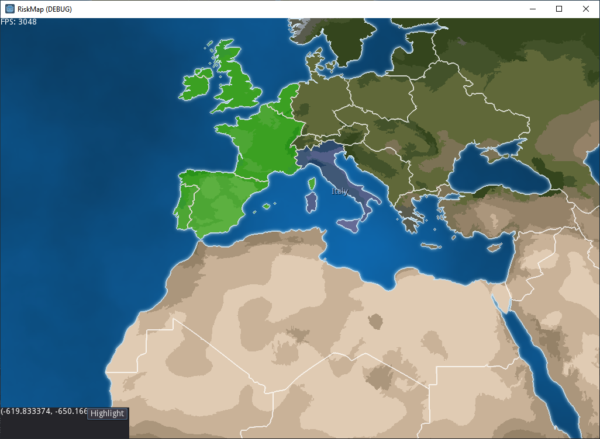

# Godot Risk-like Map

## About

This is a prototype of a Risk-like map system. It utilizes a colorized map to provide pixel perfect country selection.

Features:

- Zoom
- Map navigation
- Highlight countries
- Selection hightlight

## Creators

​The NimbleBeasts Collective is a small and open independent development studio where anyone can participate - worldwide. Support us, become part of the collective and buy our games, because they are really good.
